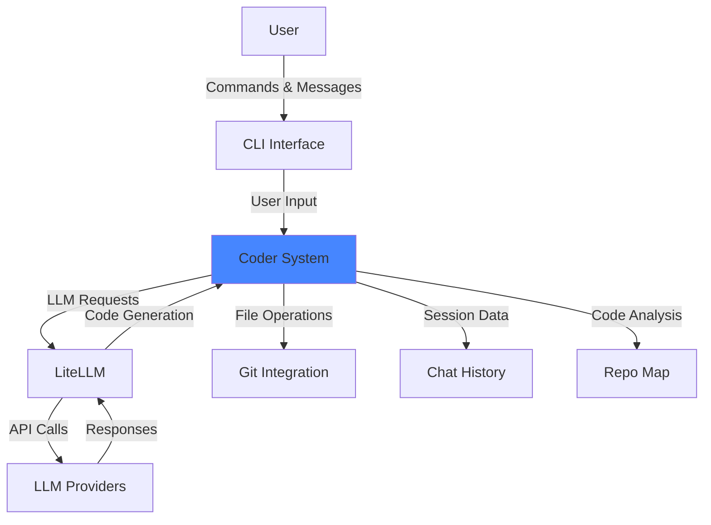
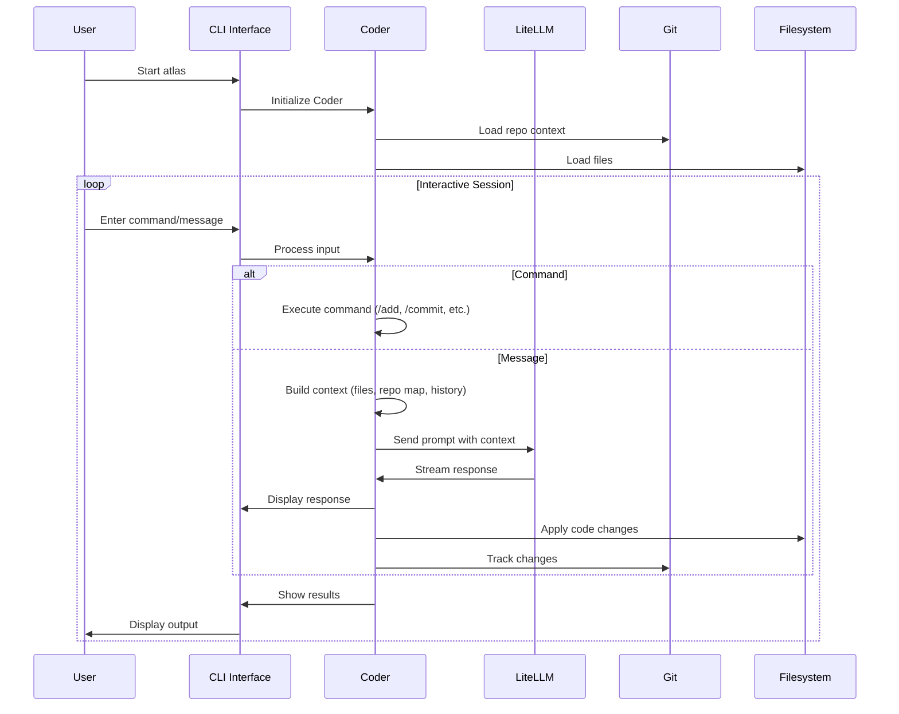
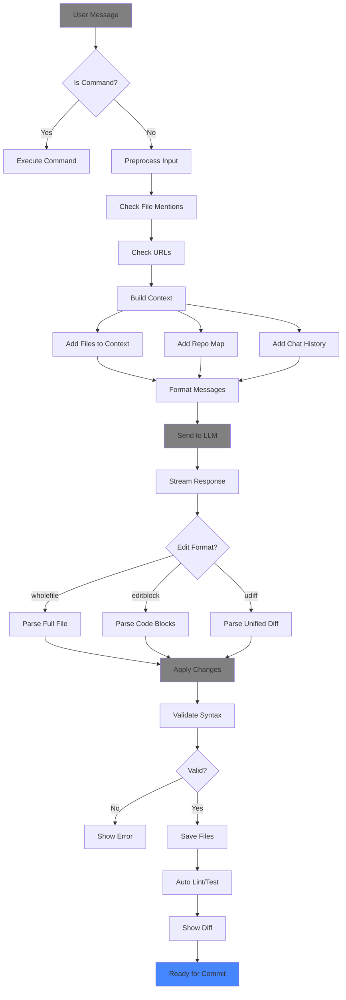
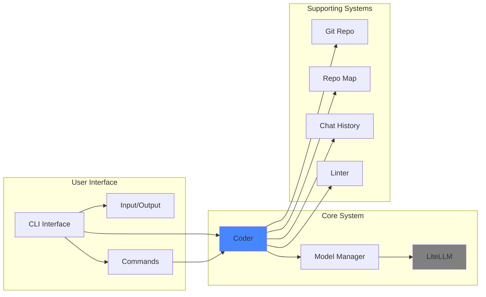
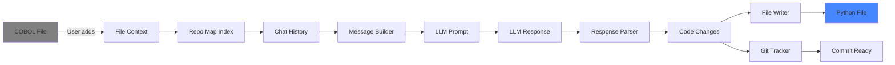
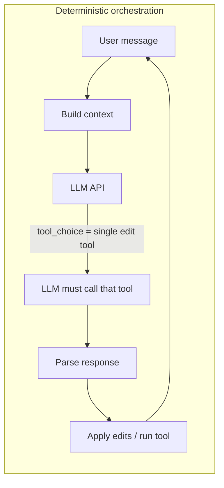
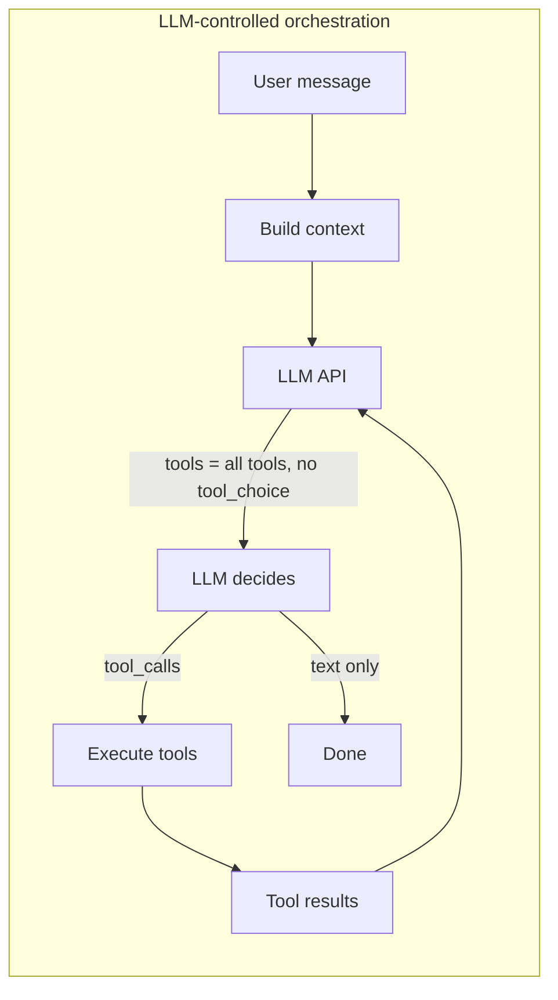
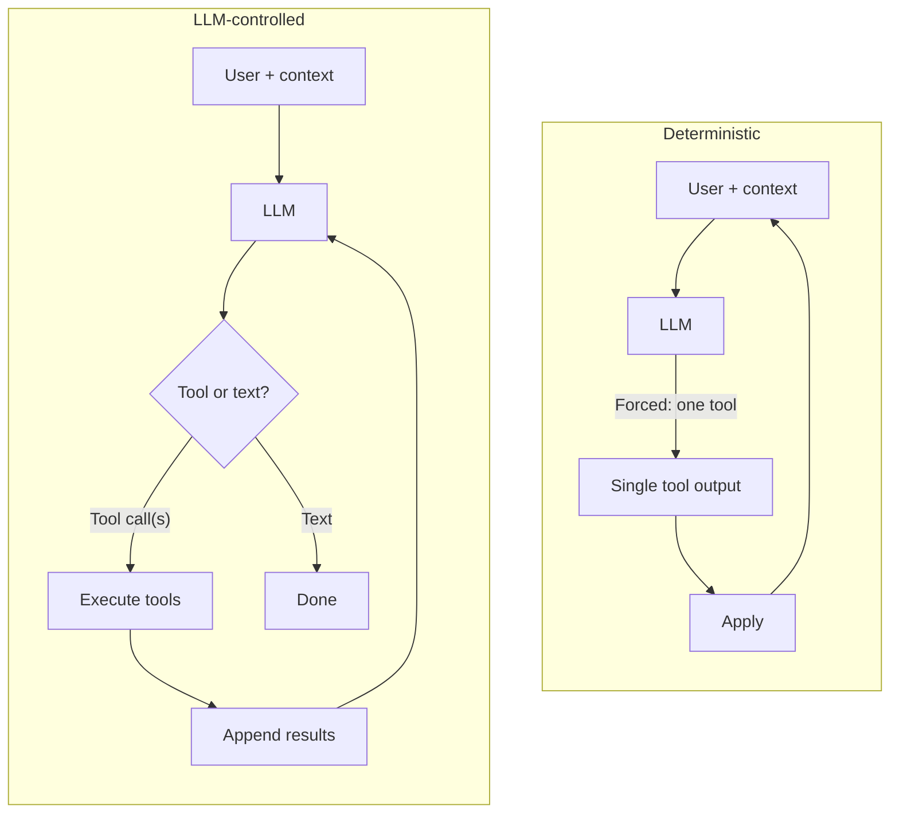

# Architecture Documentation

## Overview

Atlas (Atlas) is a **AI coding agent** that helps modernize legacy codebases such as COBOL, Fortran, Java 7, etc. to modern languages such as Python, Java, C++, etc. It uses Large Language Models (LLMs) to understand code, generate modern equivalents, and maintain conversation context throughout the modernization process.

## System Architecture

## Core Components

### 1. CLI Interface (`cli/`)

The terminal user interface (TUI) provides an interactive conversational experience:

- **Input/Output** (`cli/io.py`): Handles user input, command parsing, and formatted output
- **Commands** (`cli/commands.py`): Implements CLI commands (`/add`, `/commit`, `/help`, etc.)
- **Main Entry** (`cli/main.py`): Initializes the system, loads configuration, and starts the interactive loop

**Key Features**:
- Minimalist user interface
- Streaming responses with markdown rendering
- Command autocompletion
- File management commands

### 2. Coder System (`src/coders/`)

The heart of Atlas - handles all LLM interactions and code generation:

- **Base Coder** (`base_coder.py`): Core class managing conversation, context, and file operations
- **Edit Formats**: Multiple specialized coders for different editing styles:
  - `wholefile` - Rewrite entire files
  - `editblock` - Edit specific code blocks
  - `udiff` - Unified diff format
  - `patch` - Patch-based edits
  - `context` - Context-aware editing
  - `architect` - Design-first approach
  - `ask` - Question-answering mode
  - `help` - Interactive help system

**Location**: `src/coders/`

### 3. LLM Integration (`src/core/`)

Multi-provider LLM support via LiteLLM:

- **Models** (`core/models.py`): Model configuration and management
- **LLM** (`core/llm.py`): LiteLLM integration for 100+ providers
- **Prompts** (`core/prompts.py`): System prompts and message formatting

**Supported Providers**: OpenAI, Anthropic, DeepSeek, Gemini, and 100+ others via LiteLLM

### 4. Git Integration (`src/git/`)

Repository tracking and change management:

- **Repo** (`git/repo.py`): Git operations, commit tracking, change detection
- **Repo Map** (`git/repomap.py`): Codebase indexing using tree-sitter for context

**Features**:
- Automatic commit support
- Change tracking
- Undo functionality
- Repository-aware context

### 5. Session Management (`src/help/`)

Persistent conversation history:

- **History** (`help/history.py`): Chat summarization and context management
- **Chat History**: Maintained across sessions for continuity

### 6. Analysis Tools (`src/analysis/`)

Code analysis and quality checks:

- **Linter** (`analysis/linter.py`): Integration with code linters
- **Special** (`analysis/special.py`): Special code pattern detection

## User Interaction Flow

## Code Generation Flow

## Component Relationships

## Edit Format System

Atlas supports multiple edit formats, each optimized for different use cases:

| Format | Use Case | Description |
|--------|----------|-------------|
| `wholefile` | Complete rewrites | Rewrites entire files |
| `editblock` | Targeted edits | Edits specific code blocks |
| `udiff` | Unified diffs | Standard diff format |
| `patch` | Patch files | Apply patch-style changes |
| `context` | Context-aware | Automatically identifies files to edit |
| `architect` | Design-first | Design changes, then implement |
| `ask` | Q&A mode | Answer questions without editing |
| `help` | Interactive help | Get help about Atlas usage |

The system automatically selects the best format based on the model's capabilities, or you can specify it manually.

## Data Flow

## Technology Stack

- **LiteLLM**: Multi-provider LLM abstraction layer
- **Prompt Toolkit**: Terminal UI framework
- **Rich**: Terminal formatting and markdown rendering
- **GitPython**: Git repository operations
- **Tree-sitter**: Code parsing and indexing
- **Pydantic**: Configuration and data validation
- **Python 3.14+**: Runtime environment

## Configuration

Configuration is loaded from multiple sources (in priority order):

1. **Command-line arguments** - Highest priority
2. **`.atlas.conf.yml`** - YAML configuration file
3. **`.env`** - Environment variables
4. **Model settings** - `.atlas.model.settings.yml`
5. **Defaults** - Built-in defaults

## Session Management

- **Chat History**: Maintained in memory during session
- **History Summarization**: Long conversations are summarized to save tokens
- **Context Preservation**: Files and context persist across messages
- **Session Files**: Optional persistence to disk

## Extensibility

The architecture is designed for extensibility:

1. **Add New Edit Formats**: Create a new coder class in `src/coders/`
2. **Add New Commands**: Add methods to `cli/commands.py`
3. **Custom Prompts**: Modify prompts in `src/core/prompts.py`
4. **New LLM Providers**: Automatically supported via LiteLLM

## Tool Orchestration: Deterministic vs LLM-Controlled

Atlas supports two modes of tool use, suitable for comparing **deterministic** vs **LLM-controlled** tool orchestration in agent design.

### Deterministic tool orchestration (default)

The pipeline is fixed: one tool (the current edit format) is forced each turn. The orchestrator does not choose tools; the LLM is constrained to produce output for that single tool.

- **API**: `tools = [single_edit_function]`, `tool_choice = { function: name }` (force that function).
- **Control flow**: System chooses the tool; LLM only fills in arguments (e.g. edit content).
- **Use case**: Predictable, single-step code edits per turn.

### LLM-controlled tool orchestration (`--llm-controlled-tools`)

All registered tools (e.g. edit, git, web search) are exposed; the LLM decides which tool(s) to call and in what order. The system executes tools and feeds results back until the LLM returns a final text response.

- **API**: `tools = [all_registered_tools]`, no `tool_choice` (LLM chooses).
- **Control flow**: LLM chooses tool(s) → system executes → results appended to conversation → LLM continues (loop until text-only response or limit).
- **Use case**: Multi-step workflows (e.g. search, then edit, then commit) with one agent.

### Side-by-side comparison (for papers)

| Aspect | Deterministic | LLM-controlled |
|--------|---------------|----------------|
| Tool selection | System (fixed per turn) | LLM |
| API `tool_choice` | Set (force one function) | Not set |
| Turn structure | One tool invocation per turn | Multi-tool loop until text |
| Typical use | Single-edit code generation | Multi-step (search, edit, git, etc.) |

Implementation details: **Deterministic** — `src/core/models.py` `send_completion(..., llm_controlled_tools=False)` sets `tool_choice` to the single edit function. **LLM-controlled** — `llm_controlled_tools=True` passes all tools from `src/core/tools.py` (and command tools from `src/core/tool_registry.py`), no `tool_choice`; `base_coder._execute_tool_calls_loop()` runs the tool-call loop.

## Security Considerations

- **API Key Management**: Secure storage via environment variables
- **Input Validation**: File paths and user input are validated
- **Output Validation**: Generated code syntax is validated
- **Git Safety**: Changes are tracked and can be undone
- **Session Isolation**: Each session maintains separate context
